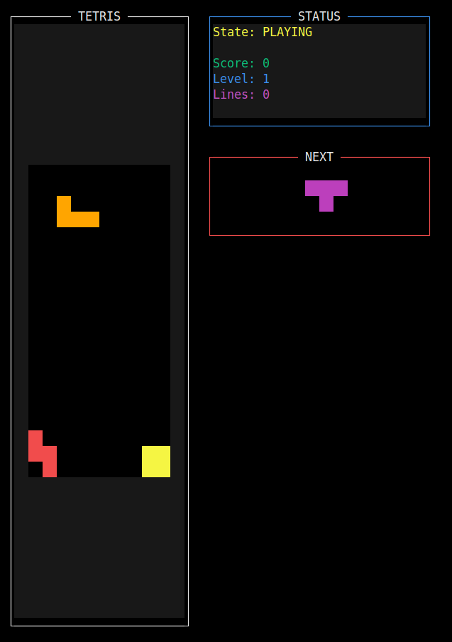

# 🟦 Go Tetris terminal edition - Because Why Not?

So I got bored one day and decided to learn Go by building Tetris in the terminal. Turns out it's actually pretty fun! 🎮

If you're wondering why anyone would make *another* Tetris clone... well, because it's the terminal version, and i thought it will be cool..now idk.



## ✨ What Does This Thing Do?

- **🎮 It's Tetris, duh**: All 7 pieces because I'm not a monster
- **⚡ Smooth-ish Controls**: Your pieces move when you press buttons (revolutionary!)
- **🎯 Next Piece Preview**: Spoiler alert for your next piece (it feels like the next next idk why)
- **📊 Numbers Go Up**: Score, level, lines - the usual dopamine hits
- **⏸️ Pause Button**: For when life interrupts your Tetris addiction
- **🌈 Pretty Colors**: Each piece type has its own color (fancy!)
- **📱 Terminal UI**: Because GUIs are for quitters
- **🎲 Fair-ish Randomization**: Uses the 7-bag system so you don't get 20 S-pieces in a row
- **⚡ Gets Faster**: Higher levels = more panic
- **💥 Satisfying Line Clears**: *chef's kiss*

## 🕹️ How to Mash Buttons

| Key | What It Does |
|-----|--------|
| `←` `→` | Move piece left/right (groundbreaking) |
| `↑` | Rotate piece clockwise (or counterclockwise, I forget) |
| `↓` | Make piece fall faster (impatience mode) |
| `Space` | YEET the piece down instantly |
| `ESC` | Pause/Resume (for bathroom breaks) |
| `Q` | Rage quit |
| `Enter` | Start playing / Try again after you lose |

## 🚀 Getting This Thing Running

### What You Need
- Go 1.19+ (or whatever version doesn't break)
- A terminal that's not from 1995
- At least 80x25 characters of screen space (it's 2025, your screen can handle it)

### Actually Building It

```bash
# Get the code (shocking, I know)
git clone https://github.com/7amdzu/go-tetris.git
cd go-tetris

# Build it (magic happens here)
make

# Or if you're fancy and don't trust my Makefile:
go build -o bin/gotetris ./cmd/gotetris
```

### Running This Masterpiece

```bash
# The lazy way
make run

# The slightly less lazy way
./bin/gotetris
```

## 🎯 How to Not Suck at This

1. **Press Enter**: Revolutionary concept, I know
2. **Move the falling blocks**: Use arrow keys like it's 1989
3. **Make lines disappear**: Fill horizontal rows completely (Tetris 101)
4. **Don't let blocks reach the top**: Game over is not the goal
5. **Get faster**: Higher levels = more stress = more fun?

### Point System (Because Numbers Matter)
- **Single Line**: 100 × level (meh)
- **Double Lines**: 300 × level (getting warmer)  
- **Triple Lines**: 500 × level (nice!)
- **Tetris (4 lines)**: 800 × level (YESSS!)

## 🏗️ Code Structure (For the Curious)

```
go-tetris/
├── cmd/gotetris/          # Where main() lives
│   └── main.go
├── internal/game/         # The actual game stuff
│   ├── loop.go           # Main game loop (the heart)
│   ├── physics.go        # Making blocks not float through each other
│   ├── piece.go          # Tetromino definitions (the important bits)
│   ├── render.go         # Making it look pretty-ish
│   ├── state.go          # Keeping track of what's happening
│   └── types.go          # Go being Go about types
├── assets/               # Music files (that don't exist)
├── bin/                  # Where the magic exe lives
├── Makefile             # Because typing is hard
├── go.mod               # Go dependency stuff
└── README.md            # This rambling document
```

## 🛠️ For Fellow Code Nerds

### Building Variations

```bash
# Clean slate (trust issues with previous builds)
make clean && make

# Paranoid mode (race condition detection because Go)
go build -race -o bin/gotetris ./cmd/gotetris
```

### What's Under the Hood
- **Game Loop**: Handles your frantic button mashing and gravity
- **Rendering**: Uses `tview` and `tcell` because terminal UIs are cool
- **Physics**: Stops pieces from phasing through reality
- **State Machine**: Keeps track of whether you're winning, losing, or paused
- **Piece Logic**: The mathematical beauty of rotating tetrominoes

## 🎨 Terminal Compatibility (Or: Will This Work?)

Works best if your terminal isn't ancient:
- ✅ Unicode support (for the fancy block characters)
- ✅ Colors (because monochrome is so 1980s)
- ✅ Arrow keys that actually work
- ✅ At least 80x25 characters (seriously, upgrade your setup)

### Tested On (aka: Terminals That Don't Suck)
- ✅ **Linux**: GNOME Terminal, Konsole, Alacritty, Kitty
- ✅ **macOS**: Terminal.app, iTerm2  
- ✅ **Windows**: Windows Terminal, WSL (sorry Command Prompt users)
(i lied here it's only tested on my machine!)

## 🐛 When Things Go Wrong (They Will)

### Game Running Like It's on Dial-up?
The speed auto-adjusts by level. If it's still weird, blame your terminal or the fat women.

### Looks Like Digital Vomit?
1. Get a terminal from this decade
2. Make your terminal window bigger (80x25 minimum, don't be cheap)
3. Check if your terminal supports colors (it's 2025, it should)

### Instructions Look Mangled?
1. Make your terminal wider (seriously, 80 characters isn't asking much)
2. Make the font smaller if you're on a potato screen
3. Try a different terminal (some are just broken)

### "Audio Disabled" Message?
Yeah, I was gonna add music but got lazy. The game works fine without it. Consider it a feature - no annoying background music!

## 🤝 Contributing (If You Really Want To)

Found bugs? Yeah, probably. My code isn't perfect (shocking, I know).

Feel free to:
- Point out my obvious mistakes
- Suggest features that'll make this actually good
- Submit pull requests (please be gentle)
- Improve this rambling documentation

Seriously though, if you spot something broken, fix it. I was learning Go while building this, so there's definitely room for improvement.

## 📄 License

It's open source. Do whatever you want with it. Build a commercial Tetris empire for all I care.

## 🎯 Maybe Future Stuff (If I Get Motivated)

- [ ] Save high scores (because bragging rights)
- [ ] Actual background music (if I stop being lazy)
- [ ] Different game modes (Sprint, Marathon, etc.)
- [ ] Customizable controls (for the picky people)
- [ ] Themes and visual mods (make it your own)
- [ ] Multiplayer (because single-player is lonely)
- [ ] AI opponent (to crush your dreams)

---

**Go play some Tetris! 🎮**

*Built with coffee, frustration, about 25 cigs and a surprising amount of Go documentation*
